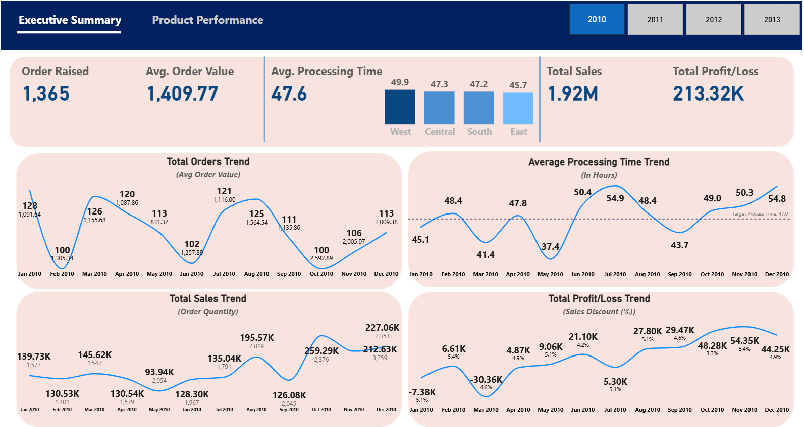
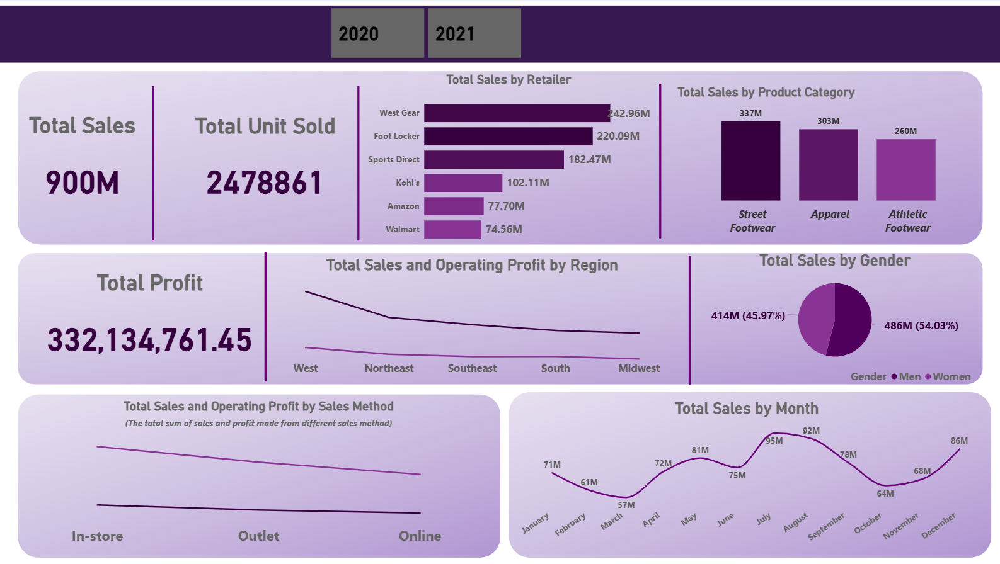
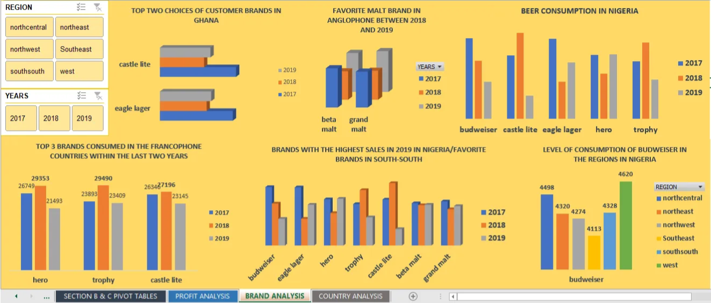

<!--Section 1: Introduce your self-->
## ABOUT ME

Hello! I'm Emmanuel Obisesan 🤓
I'm a data analyst and client management professional with a passion for turning data into actionable insights. With several years of experience across sales, operations, and client management, I’ve seen firsthand how data drives client retention, operational efficiency, and business growth. This realization sparked my journey into data analysis, where I’ve trained and worked with tools like Power BI, Excel, and SQL to uncover trends, build dashboards, and support smarter decision-making. This GitHub space showcases my learning journey, hands-on projects, and continuous growth in the world of data and analytics.

<!--Mention your top/relevant skills here - core and soft skills-->
## WHAT I DO

**- ✅ Data Wrangling.**
I clean and transform messy, unstructed data using tools like Excel and Power BI, preparing it for accurate and efficient analysis.

**- ✅ Insight Generation and Data Visualization.**
Beyond data wrangling, I specialize in generating business insights through data visualization with Power BI, turning data into clear, actionable insights to help you make data-driven decisions, optimize processes, and drive business growth.

<!--Section 2: List 3-4 key projects-->
## MY PROJECTS 

*A glimpse of some of the projects I've been working on.*

**Edenbridge Sales Performance Dashboard.**

Tool used: Power BI
This project provides a detailed analysis of a superstore's sales performance from 2010 to 2013. It covers key business metrics such as total sales, profit/loss, processing time, customer orders, and regional performance. Through interactive dashboards, I highlighted trends in order volume, sales by region, and top-performing products. The goal was to generate insights that support better decision-making around inventory, customer targeting, and operational efficiency.

[See More](https://app.powerbi.com/view?r=eyJrIjoiODVhYTM1OWMtNjI4OS00NzFiLThhOWEtOTJiZWNiZTVlOTI2IiwidCI6IjdjZDg4NzM5LWJlMGQtNDVjMC04YWY5LWI0YjBiN2IzYWVkYSJ9)

**Adidas Retail Sales Performance Analysis.**

Tool used: Power BI
This dashboard analyzes the retail sales performance of various footwear and apparel products across multiple channels in 2020 and 2021. It highlights key metrics such as total sales, total units sold, profit, and sales distribution by retailer, product category, gender, region, and sales method. The insights reveal top-performing retailers, customer preferences, and seasonal trends in monthly sales. The goal was to identify opportunities for growth and optimize sales strategies based on data-driven insights. 

[See More](https://app.powerbi.com/view?r=eyJrIjoiNGQ5MmYxY2UtOWJkNi00YzZiLWE2MTQtOGY4MTFmNmY3YmYyIiwidCI6IjdjZDg4NzM5LWJlMGQtNDVjMC04YWY5LWI0YjBiN2IzYWVkYSJ9)

**An Analysis on International Breweries Sales Report.**

Tool used: Excel
In this project, I examined the dataset that was provided by international breweries through with the sole aim to proffer recommendations in order to maximize profit, reduce loss to the lowest minimum and increase sales. 

[Read More](https://medium.com/@emmieobisesan/excel-portfolio-project-an-analysis-on-international-breweries-sales-report-8ee4b473258f)

## CONTACT DETAILS

*Let’s connect and see how we can make a difference together!*
<table>
  <tbody>
    <tr>
      <td>📧</td>
      <td><a href="mailto:oluwatobiobisesan9@gmail.com">oluwatobiobisesan9@gmail.com</a></td>
    </tr>
    <tr>
      <td>📞</td>
      <td>(234) 810-914-4932</td>
    </tr>
    <tr>
      <td>📍</td>
      <td>Lagos, Nigeria</td>
    </tr>
    <tr>
      <td>⬇️</td>
      <td><a href="https://etuk123456.github.io/portfolio1/docs/Profile.pdf">Download my CV</a></td>
    </tr>
    <tr>
      <td>🌐</td>
      <td><a href="https://www.linkedin.com/in/oluwatobi-emmanuel-obisesan-b6a51919a/">LinkedIn</a></td>
    </tr>
    <tr>

   

